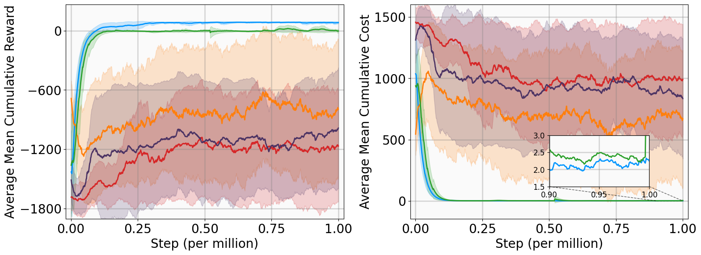

# MSACL: Multi-Step Actor-Critic Learning with Lyapunov Certificates for Exponentially Stabilizing Control

## Description
The MSACL repository is a modular reinforcement learning (RL) training framework specifically designed for model-free exponentially stabilizing continuous control tasks, such as quadrotor trajectory tracking and car trajectory tracking. **This project not only provides an efficient engineering implementation but also introduces innovative mechanisms with theoretical guarantees at the algorithmic level, aiming to solve stability  challenges in complex nonlinear control.**

We developed a diverse suite of six nonlinear dynamical environments, spanning four stabilization tasks (e.g., VanderPol) and two high-dimensional tracking tasks (e.g., Quadrotor Trajectory Tracking), to rigorously evaluate and provide a standard for Lyapunov-based RL algorithms:
- VanderPol
- Pendulum
- DuctedFan
- Two-link
- SingleCarTracking
- QuadrotorTracking

Meanwhile, we reproduced two off-policy RL algorithms (SAC, PPO) and two RL stability algorithms based on Lyapunov function (LAC, POLYC), and compared the performance of MSACL (ours) with that of the four algorithms in the above six environments.
- [SAC](https://doi.org/10.48550/arXiv.1812.05905)
- [PPO](https://doi.org/10.48550/arXiv.1707.06347)
- [LAC](https://doi.org/10.1109/LRA.2020.3011351)
- [POLYC](https://doi.org/10.1109/ICRA48506.2021.9560886)
- [MSACL](https://doi.org/10.48550/arXiv.2512.24955)

And the overall flowchart of MSACL is illustrated in following picture.
<center>

  <figcaption style="font-size: 14px; color: #666; margin-top: 8px;">
    Fig 1. MSACL algorithm flow chart
  </figcaption>
</center>

You can read more about MSACL algorithm and the environments in our [paper](https://doi.org/10.48550/arXiv.2512.24955). 

## Target Audience: 
This repository is highly suitable for researchers and engineers in the field of robot control, particularly for continuous control tasks like quadrotor flight, where guaranteed exponential stability is paramount for achieving high-precision trajectory tracking and robust performance.


## Core Features
- ✅ Modular Design: Decouples core components (algorithms, sampling, experience replay, evaluators, etc.) for easy extension and replacement
- ✅ N-step Off-policy Training: Supports the off-policy serial training process for MSACL learning
- ✅ Prioritized Experience Replay (PER): Optional PER activation to improve sample utilization efficiency
- ✅ GPU Acceleration: Supports GPU deployment of training data and networks to boost training speed
- ✅ Comprehensive Evaluation System: Built-in evaluator tracks reward/cost metrics during training and automatically saves the optimal model
- ✅ TensorBoard Visualization: Real-time monitoring of training metrics, memory usage, sampling/training time consumption, etc.


## Dependencies
For detail, please refer to the *env_installation_guide.txt* file.
1. create conda environment depending on your OS:
```bash
conda create -n MSACL python=3.10 -y
conda activate MSACL
```
2. Installation command:
```bash
pip install -r requirements.txt
```
3. install MSACL
```bash
pip install -e .
```
## Quick Start
### 1. Prepare Training Configuration
Create a training configuration script (e.g., msacl_train.py) in the example/ directory and configure core parameters:
```python
import argparse
import math
from RL.create_pkg.create_envs import create_envs
from RL.utils.init_args import init_args
from RL.create_pkg.create_alg import create_alg
from RL.create_pkg.create_sampler import create_sampler
from RL.create_pkg.create_buffer import create_buffer
from RL.create_pkg.create_evaluator import create_evaluator
from RL.create_pkg.create_trainer import create_trainer
from RL.utils.tensorboard_setup import save_tb_to_csv, open_tb_in_browser

# Parameter configuration
if __name__ == "__main__":
    parser = argparse.ArgumentParser()
    parser.add_argument(your desired parameters)


args = vars(parser.parse_args())
envs = create_envs(**args)
args = init_args(envs,** args)
alg = create_alg(**args)
sampler = create_sampler(**args)
buffer = create_buffer(**args)
evaluator = create_evaluator(**args)
trainer = create_trainer(alg, sampler, buffer, evaluator,** args)
trainer.train()
save_tb_to_csv(args["save_folder"])
open_tb_in_browser(args["save_folder"])
```
### 2. Run the Training Script
```bash
python msacl_train.py
```
### 3. View Training Results
- Model files: ./results/quad_tracking/apprfunc/ (including regular models and optimal models *_opt.pkl)
- TensorBoard visualization: tensorboard --logdir=./results/quad_tracking

Key monitorable metrics:
- Reward/Cost mean/standard deviation (TRM/TCM/TRS/TCS)
- Experience buffer memory usage (Buffer RAM)
- Sampling/training time consumption (alg_time/sampler_time)

After processing the run results, you can see the following figures:

<center>
  
  <figcaption style="margin-top: 10px; font-family: Arial, sans-serif; font-size: 14px; line-height: 1.6;">
    <!-- MSACL (Ours) -->
    <span style="display: inline-block; margin: 0 15px;">
      <span style="display: inline-block; width: 12px; height: 12px; margin-right: 5px; vertical-align: middle; border-radius: 2px; background-color: #0095FF;"></span>
      MSACL (Ours)
    </span>
    <!-- SAC -->
    <span style="display: inline-block; margin: 0 15px;">
      <span style="display: inline-block; width: 12px; height: 12px; margin-right: 5px; vertical-align: middle; border-radius: 2px; background-color: #FF7F0E;"></span>
      SAC
    </span>
    <!-- LAC -->
    <span style="display: inline-block; margin: 0 15px;">
      <span style="display: inline-block; width: 12px; height: 12px; margin-right: 5px; vertical-align: middle; border-radius: 2px; background-color: #2CA02C;"></span>
      LAC
    </span>
    <!-- PPO -->
    <span style="display: inline-block; margin: 0 15px;">
      <span style="display: inline-block; width: 12px; height: 12px; margin-right: 5px; vertical-align: middle; border-radius: 2px; background-color: #D62728;"></span>
      PPO
    </span>
    <!-- POLYC -->
    <span style="display: inline-block; margin: 0 15px;">
      <span style="display: inline-block; width: 12px; height: 12px; margin-right: 5px; vertical-align: middle; border-radius: 2px; background-color: #4D3464;"></span>
      POLYC
    </span>
  </figcaption>
  <figcaption style="font-size: 14px; color: #666; margin-top: 8px;">
    Fig 2. Performance comparison of MSACL, SAC, LAC, PPO, POLYC
  </figcaption>
</figure>
</center>


<center>

  <figcaption style="font-size: 14px; color: #666; margin-top: 8px;">
    Fig 3. Lyaponuv function of DuctedFan (projections in the (x,y)-plane with θ=0)
  </figcaption>
</center>

<center>

  <figcaption style="font-size: 14px; color: #666; margin-top: 8px;">
    Fig 4. Tracking performance of the QuadrotorTracking task with noises(MSACL)
  </figcaption>
</center>

## Code Structure
```plaintext
MSACL/
├── RL/                    # Core functionality directory
│   ├── apprfunc/          # Approximation function module
│   ├── env/               # Environment definition module
│   ├── trainer/           # Trainer module
│   │   ├── on_serial_trainer.py    # On-policy serial trainer
│   │   ├── off_serial_trainer.py   # Off-policy serial trainer
│   │   ├── evaluator.py            # Evaluator
│   │   └── nstep_off_serial_trainer.py  # N-step off-policy serial trainer
│   ├── sampler/           # Sampler module
│   ├── buffer/            # Experience replay buffer module
│   ├── utils/             # Utility function module
│   ├── create_pkg/        # Package creation tools
│   └── algorithm/         # Algorithm module
├── example/               # Example training scripts
└── requirements.txt       # Dependencies list
```
## Visualization and Logging
### 1. Core TensorBoard Tags (tb_tags)
| Tag Name | Description |
|--------|------|
| Buffer RAM of RL iteration | Experience buffer memory usage (MB) |
| TRM of RL iteration | Average reward corresponding to iteration |
| TRS of RL iteration | Standard deviation of reward corresponding to iteration |
| TCM of RL iteration | Average cost corresponding to iteration |
| TCS of RL iteration | Standard deviation of cost corresponding to iteration |
| alg_time | Algorithm update time consumption |
| sampler_time | Environment sampling time consumption |

### 2. Results Directory Structure
```plaintext
./results/quad_tracking/
├── apprfunc/          # Model files (regular models + optimal models)
│   ├── apprfunc_10000.pkl
│   └── apprfunc_5000_opt.pkl  # Optimal model
├── events.out.tfevents.*  # TensorBoard log files
└── data/  # the evaluator data
```